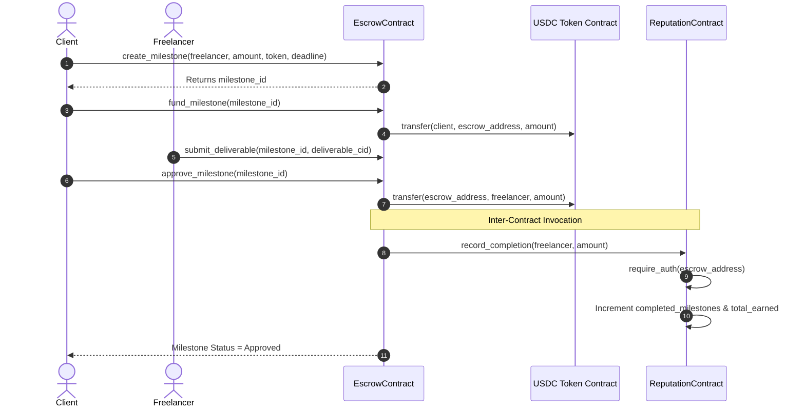

# PayStream Lite — Technical Architecture & Deep Dive

PayStream Lite is built on Stellar Soroban smart contracts, featuring inter-contract calls, event-driven streaming, and a responsive decentralized web frontend.

---

## 1. System Overview & Contract Wiring

PayStream Lite relies on two distinct Soroban smart contracts working in tandem:

1. **EscrowContract (`paystream_escrow.wasm`)**:
   - Manages client funds in milestone escrows (USDC / Stellar tokens).
   - Enforces state transition machine (`Created` -> `Funded` -> `Submitted` -> `Approved` / `Disputed` / `Refunded`).
   - Emits structured Soroban events on every state transition.
   - Executes an **inter-contract call** to `ReputationContract` when a milestone is approved by the client.

2. **ReputationContract (`paystream_reputation.wasm`)**:
   - Stores on-chain freelancer performance metrics (`completed_milestones` count & `total_earned` token value).
   - Protects state mutation with strict `require_auth` on the caller address, restricting calls exclusively to the registered `EscrowContract`.

---

## 2. Inter-Contract Communication Sequence



---

## 3. Real-Time Event Streaming Architecture

Rather than requiring manual page refreshes, the frontend connects to Soroban RPC's `getEvents` endpoint:

```
[ EscrowContract Events ] ──( Soroban RPC getEvents )──> [ useEvents Hook ] ──> [ React UI & Toast Alerts ]
```

### Published Soroban Topics & Payload Schemas:
- `("milestone", "created")` -> `(milestone_id, client, freelancer, amount)`
- `("milestone", "funded")` -> `(milestone_id, client, amount)`
- `("milestone", "submitted")` -> `(milestone_id, freelancer)`
- `("milestone", "approved")` -> `(milestone_id, freelancer, amount)`
- `("milestone", "disputed")` -> `(milestone_id, caller)`
- `("milestone", "refunded")` -> `(milestone_id, client, amount)`

---

## 4. Security & Access Control

- **Auth Verification**: Every state-changing function requires `address.require_auth()`.
- **Restricted Inter-Contract Auth**: `ReputationContract` stores the official `EscrowContract` address at initialization. Calls from unauthorized addresses panic immediately.
- **Expiration Refunds**: Clients can only claim refunds via `refund_expired` if the current Soroban ledger timestamp exceeds the specified `deadline`.
